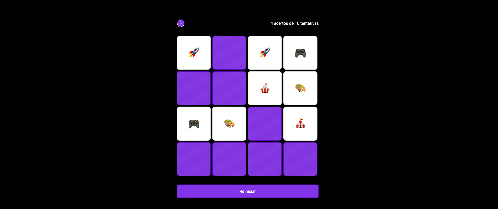

# 🧠 Jogo da Memória

### 📸 Preview

Um jogo da memória simples e divertido, desenvolvido 100% com **HTML**, **CSS** e **JavaScript** puro. Ideal para quem está estudando lógica de programação, manipulação do DOM e interações básicas com o usuário.

🔗 **Acesse o jogo:** [Clique aqui para jogar](https://orodrigogo.github.io/memory/)

---

### 🕹️ Como Jogar

1. Clique nas cartas para revelá-las.
2. Encontre os pares de cartas iguais.
3. Tente completar o jogo com o menor número de tentativas possível!

---

### 🚀 Tecnologias Utilizadas

- HTML5
- CSS3
- JavaScript (vanilla JS)

---

### 📁 Estrutura do Projeto

📦 memory/

- index.html
- styles.css
- scripts.js
- assets/

---

### 🧩 Funcionalidades

- Animação de virar carta
- Verificação automática de pares
- Mensagem quando todos os pares são encontrados

---

Desenvolvido por Rodrigo Gonçalves com 💙.
